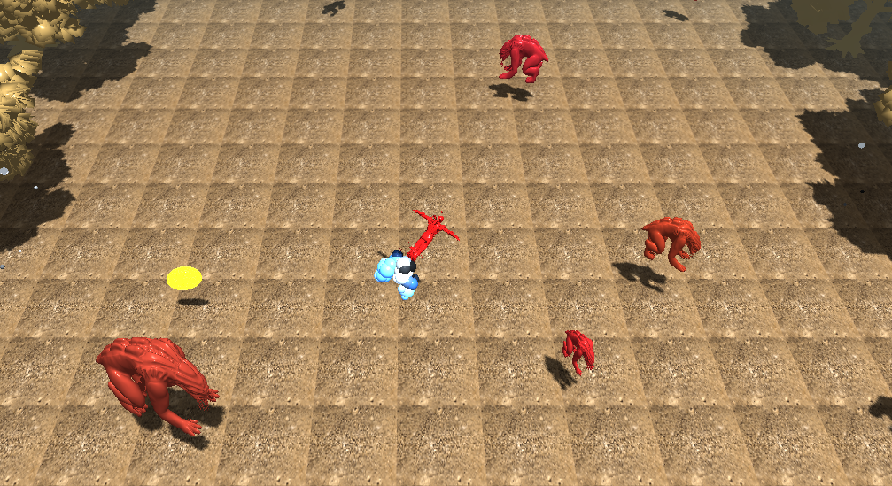
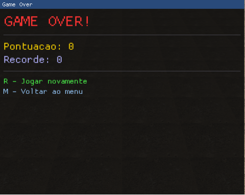

# 🎮 Iron Man: Corrida 3D


Um jogo de corrida endless runner em 3D desenvolvido com OpenGL, C++ e GLFW, apresentando o Iron Man desviando de aliens e coletando bitcoins em alta velocidade!


---

## ✨ **Features**

### 🎨 **Gráficos Avançados**
- ✅ Motion Blur com sistema de partículas
- ✅ Shadow Mapping dinâmico
- ✅ Fog atmosférica para profundidade
- ✅ Céu gradiente dinâmico
- ✅ Explosões espetaculares com física realista
- ✅ Iluminação Phong com specular highlights
- ✅ Múltiplas fileiras de árvores procedurais

### 🎮 **Gameplay**
- ✅ Sistema de dificuldade progressiva
- ✅ Aliens com tamanhos variados (normais, grandes, gigantes)
- ✅ Moedas raras (1 a cada ~10 aliens)
- ✅ Física de movimento suave
- ✅ Sistema de pontuação e recordes
- ✅ Velocidade aumentada em 50%

### 🔧 **Técnicas Implementadas**
- ✅ 5 sistemas de partículas diferentes
- ✅ Geração procedural de obstáculos
- ✅ Shader programming (GLSL)
- ✅ Carregamento de modelos .OBJ
- ✅ Mapeamento de texturas
- ✅ Controle de câmera dinâmica

---

## 📋 **Pré-requisitos**

### Software Necessário:
- **Visual Studio 2019 ou superior** (com C++ Desktop Development)
- **Windows 10/11** (64-bit)
- **Git** (para clonar o repositório)

### Bibliotecas Incluídas:
- GLFW 3.4 (extrair em C:/)
- GLAD (extrair em C:/)
- GLM (extrair na pasta do projeto)
- ImGui
- TinyObjLoader
- STB Image

---

## 📂 **Estrutura do Projeto**

```
corrida3d_cg/
├── external/
│   ├── glfw/                 # Biblioteca GLFW (opcional, se quiser local)
│   ├── glad/                 # Loader OpenGL
│   ├── glm/                  # Matemática 3D (EXTRAIR AQUI!)
│   ├── imgui/                # Interface gráfica
│   ├── tinyobjloader/        # Carregador de .OBJ
│   ├── stb_image.h           # Carregador de imagens
│   ├── models/               # Modelos 3D
│   │   ├── IronMan/
│   │   ├── alien/
│   │   ├── bitcoin/
│   │   ├── cloud/
│   │   └── white_oak/
│   └── textures/             # Texturas
│       └── concretewall.jpg
├── src/
│   └── main.cpp              # Código fonte principal
├── glfw34.zip                # GLFW zipado (extrair em C:/)
├── glad.zip                  # GLAD zipado (extrair em C:/)
├── glm.zip                   # GLM zipado (extrair em external/)
└── README.md
```

---

## 🚀 **Instalação e Configuração**

### **Passo 1: Clonar o Repositório**

```bash
git clone https://github.com/seu-usuario/corrida3d_cg.git
cd corrida3d_cg
```

---

### **Passo 2: Extrair Bibliotecas**

#### 🔷 **Extrair GLFW 3.4 na Raiz C:/**

1. Localize o arquivo `glfw34.zip` na pasta do projeto
2. **Extrair para `C:/glfw34/`**
   - Clique com o botão direito em `glfw34.zip`
   - Selecione "Extrair Tudo..."
   - Digite como destino: `C:\`
   - A pasta final deve ser: `C:/glfw34/`

3. **Verificar estrutura:**
   ```
   C:/glfw34/
   ├── include/
   │   └── GLFW/
   │       └── glfw3.h
   └── lib-vc2022/  (ou lib-vc2019)
       └── glfw3.lib
   ```

#### 🔷 **Extrair GLAD na Raiz C:/**

1. Localize o arquivo `glad.zip` na pasta do projeto
2. **Extrair para `C:/glad/`**
   - Clique com o botão direito em `glad.zip`
   - Selecione "Extrair Tudo..."
   - Digite como destino: `C:\`
   - A pasta final deve ser: `C:/glad/`

3. **Verificar estrutura:**
   ```
   C:/glad/
   ├── include/
   │   ├── glad/
   │   │   └── glad.h
   │   └── KHR/
   │       └── khrplatform.h
   └── src/
       └── glad.c
   ```

#### 🔷 **Extrair GLM na Pasta do Projeto**

1. Localize o arquivo `glm.zip` na pasta do projeto
2. **Extrair para a pasta `external/` do projeto**
   - Clique com o botão direito em `glm.zip`
   - Selecione "Extrair Tudo..."
   - Digite como destino: `[pasta-do-projeto]/external/`
   - A pasta final deve ser: `[pasta-do-projeto]/external/glm/`

3. **Verificar estrutura:**
   ```
   corrida3d_cg/external/glm/
   ├── glm/
   │   ├── glm.hpp
   │   ├── ext/
   │   ├── gtc/
   │   ├── gtx/
   │   └── ...
   └── ...
   ```

**Exemplo de caminho completo:**
```
C:/Projetos/modeltest/external/glm/glm/glm.hpp
```

**⚠️ IMPORTANTE:** O GLM é uma biblioteca header-only, então deve estar na pasta `external/glm/` do seu projeto!

---

### **Passo 3: Configurar Visual Studio**

#### 3.1 Abrir o Projeto

1. Abra **Visual Studio**
2. Selecione **"Abrir uma pasta"**
3. Navegue até a pasta `corrida3d_cg`

#### 3.2 Configurar CMakeLists.txt ou Projeto

Se estiver usando um `.sln`, configure as propriedades:

**Propriedades do Projeto** → **C/C++** → **Geral** → **Diretórios de Inclusão Adicionais:**
```
C:/glfw34/include
C:/glad/include
$(ProjectDir)external
$(ProjectDir)external/glm
```

**Propriedades do Projeto** → **Vinculador** → **Geral** → **Diretórios de Biblioteca Adicionais:**
```
C:/glfw34/lib-vc2022
```

**Propriedades do Projeto** → **Vinculador** → **Entrada** → **Dependências Adicionais:**
```
glfw3.lib
opengl32.lib
```

#### 3.3 Adicionar Arquivos ao Projeto

Certifique-se de incluir:
- `src/main.cpp`
- `C:/glad/src/glad.c`
- Todos os arquivos `.cpp` do `external/imgui/`

---

### **Passo 4: Compilar o Projeto**

1. Selecione a configuração **Release** ou **Debug**
2. Selecione plataforma **x64**
3. Pressione **Ctrl + Shift + B** ou clique em **Compilar** → **Compilar Solução**

---

### **Passo 5: Executar o Jogo**

1. Pressione **F5** para executar com depuração
2. Ou **Ctrl + F5** para executar sem depuração

---

## 🎮 **Como Jogar**

### **Controles:**

| Tecla | Ação |
|-------|------|
| **W** | Mover para frente |
| **S** | Mover para trás |
| **A** | Mover para esquerda |
| **D** | Mover para direita |
| **Setas** | Rotacionar câmera |
| **ESPAÇO** | Iniciar jogo / Reiniciar |
| **M** | Voltar ao menu (Game Over) |
| **F11** | Alternar tela cheia |
| **ESC** | Sair do jogo |

### **Objetivo:**
- 🛸 **Desvie dos aliens** (quanto maiores, mais perigosos!)
- 🪙 **Colete bitcoins raros** (+10 pontos cada)
- 🏆 **Sobreviva o máximo de tempo possível**
- ⚡ **A velocidade aumenta progressivamente!**

---

## ⚙️ **Configuração de Caminhos**

Se você estiver usando caminhos diferentes, edite no `main.cpp`:

```cpp
const std::string BASE_PATH = "C:/Users/SeuUsuario/caminho/para/external/";
```

Certifique-se de que a estrutura `external/` contenha:
```
external/
├── models/
│   ├── IronMan/IronMan.obj
│   ├── alien/Alien Animal.obj
│   ├── bitcoin/bitcoin.obj
│   ├── cloud/*.obj
│   └── white_oak/white_oak.obj
└── textures/
    └── concretewall.jpg
```

---

## 🐛 **Troubleshooting**

### **Erro: "Cannot open include file 'GLFW/glfw3.h'"**
- ✅ Verifique se `C:/glfw34/include` está em **Diretórios de Inclusão**
- ✅ Certifique-se de que extraiu `glfw34.zip` para `C:/glfw34/`

### **Erro: "Cannot open include file 'glad/glad.h'"**
- ✅ Verifique se `C:/glad/include` está em **Diretórios de Inclusão**
- ✅ Certifique-se de que extraiu `glad.zip` para `C:/glad/`

### **Erro: "Cannot open include file 'glm/glm.hpp'"**
- ✅ Verifique se `$(ProjectDir)external/glm` está em **Diretórios de Inclusão**
- ✅ Certifique-se de que extraiu `glm.zip` para `[pasta-do-projeto]/external/glm/`
- ✅ O caminho deve ser: `[pasta-do-projeto]/external/glm/glm/glm.hpp`

### **Erro: "LNK1120: Unresolved external symbol"**
- ✅ Adicione `glfw3.lib` e `opengl32.lib` em **Dependências Adicionais**
- ✅ Verifique se `C:/glfw34/lib-vc2022` está em **Diretórios de Biblioteca**

### **Erro: "Modelo não encontrado"**
- ✅ Verifique o caminho em `BASE_PATH` no código
- ✅ Certifique-se de que a pasta `external/models/` existe

### **Jogo travando / FPS baixo**
- ✅ Reduza o número de árvores (já otimizado para 72)
- ✅ Compile em **Release** mode (não Debug)
- ✅ Verifique se sua GPU suporta OpenGL 3.3+

### **Tela preta ao iniciar**
- ✅ Verifique se as texturas estão na pasta `external/textures/`
- ✅ Compile com todas as bibliotecas ImGui incluídas

---

## 📊 **Características Técnicas**

### **Sistemas Implementados:**

| Sistema | Descrição |
|---------|-----------|
| **Shadow Mapping** | Sombras dinâmicas em tempo real |
| **Particle Systems** | 5 sistemas diferentes (thruster, speed, collect, explosion, wind) |
| **Procedural Generation** | Árvores e obstáculos com variação aleatória |
| **Fog Rendering** | Neblina atmosférica no fragment shader |
| **OBJ Loading** | Carregamento de modelos 3D complexos |
| **Texture Mapping** | Mapeamento de texturas com mipmaps |
| **Dynamic Lighting** | Iluminação Phong com componentes ambientes, difusas e especulares |
| **Camera System** | Câmera que segue o jogador com rotação livre |

---

## 🎓 **Conceitos Acadêmicos Demonstrados**

1. **Computação Gráfica:**
   - Pipeline gráfico OpenGL
   - Transformações geométricas (modelagem, visão, projeção)
   - Iluminação e sombreamento
   - Mapeamento de texturas

2. **Programação de Shaders:**
   - Vertex Shader (transformações)
   - Fragment Shader (iluminação + fog)

3. **Estruturas de Dados:**
   - Vetores dinâmicos (std::vector)
   - Sistemas de partículas
   - Gerenciamento de memória

4. **Algoritmos:**
   - Detecção de colisão
   - Geração procedural
   - Sistema de física simplificado

5. **Arquitetura de Software:**
   - Separação de responsabilidades
   - Game loop
   - Estados do jogo (Menu, Playing, Game Over)

---

## 📝 **Licença**

Este projeto é licenciado sob a licença MIT - veja o arquivo LICENSE para detalhes.

---

## 👨‍💻 **Autor**

Desenvolvido como projeto acadêmico de Computação Gráfica.

**Universidade:** [Sua Universidade]  
**Curso:** Ciência da Computação  
**Disciplina:** Computação Gráfica  
**Ano:** 2025

---

## 🙏 **Créditos**

### Bibliotecas:
- [GLFW](https://www.glfw.org/) - Criação de janelas OpenGL
- [GLAD](https://glad.dav1d.de/) - Loader OpenGL
- [GLM](https://github.com/g-truc/glm) - Matemática 3D
- [Dear ImGui](https://github.com/ocornut/imgui) - Interface gráfica
- [TinyObjLoader](https://github.com/tinyobjloader/tinyobjloader) - Loader de .OBJ
- [STB Image](https://github.com/nothings/stb) - Loader de imagens

### Modelos 3D:
- Iron Man, Alien, Bitcoin, Árvores, Nuvens (fontes especificadas no projeto)

---

## 🌟 **Agradecimentos**

Agradecimentos especiais aos professores e colegas que contribuíram para o desenvolvimento deste projeto!

---

**⭐ Se você gostou deste projeto, dê uma estrela no repositório!**

---

## 📸 **Screenshots**

### Menu Principal


### Gameplay


### Game Over


---

**Última atualização:** Outubro 2025